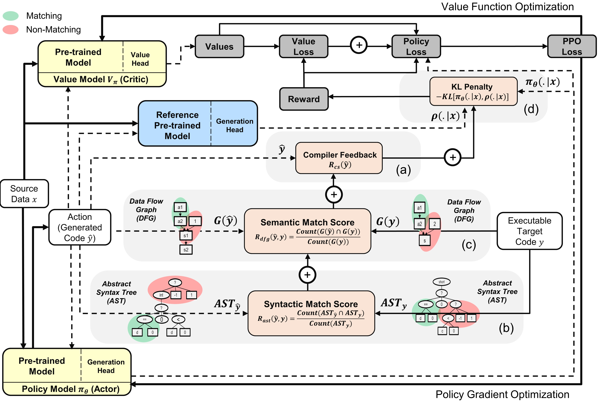

# PPOCoder

Official Implementation of [Execution-based Neural Code Generation using Proximal Policy Optimization](https://arxiv.org/abs/2301.13816)

## Overview
The utilization of programming language (PL) models, pretrained on large-scale code corpora, as a means of automating software engineering processes has demonstrated considerable potential in streamlining various code generation tasks such as code completion, code translation, and program synthesis. However, current approaches mainly rely on supervised fine-tuning objectives borrowed from text generation, neglecting specific sequence-level features of code, including but not limited to compilability as well as syntactic and functional correctness. To address this limitation, we propose **PPOCoder**, a new framework for code generation that combines pretrained PL models with Proximal Policy Optimization (PPO) deep reinforcement learning and employs execution feedback as the external source of knowledge into the model optimization. PPOCoder is transferable across different code generation tasks and PLs.
<br style="height:-150px;">

<p align="center">

 <br>
<b>Overview of the PPOCoder with actor and critic models</b>: The action is sampled from the policy based on the given source data $x$ (NL or PL). Then, a reward is obtained for each action to guide and control policy updates. The reward function is composed of four elements: (a) compiler feedback; (b) syntactic matching score based on ASTs; (c) semantic matching score based on DFGs; and (d) KL-divergence penalty between active policy and the reference pretrained model. 
The critic model estimates value based on the obtained reward and PPOCoder will be optimized with PPO, which takes into account both value and policy optimization.
</p>
<!-- <p align="center">

 <br>
<b>Overview of the PPOCoder with actor and critic models</b>: The action is sampled from the policy based on the given source data $x$ (NL or PL). Then, a reward is obtained for each action to guide and control policy updates. The reward function is composed of four elements: (a) compiler feedback; (b) syntactic matching score based on ASTs; (c) semantic matching score based on DFGs; and (d) KL-divergence penalty between active policy and the reference pretrained model. 
The critic model estimates value based on the obtained reward and PPOCoder will be optimized with PPO, which takes into account both value and policy optimization.
</p> -->


## Environment Installation
To run the code, install the dependencies in requirements.txt.
```
pip install -r requirements.txt
```


## Datasets
We finetune/evaluate models on the following major dataset benchmarks for different code generation tasks:

* **CodeSearchNet (CSN)** is available [here](https://github.com/github/CodeSearchNet##data-details)
* **XLCoST** is available [here](https://github.com/reddy-lab-code-research/XLCoST)
* **APPS** is available [here](https://github.com/hendrycks/apps)
* **MBPP** is available [here](https://github.com/google-research/google-research/tree/master/mbpp)

We preprocess the data and construct input/output sequences in the same manner as outlined in the original benchmark papers. Unzip and place all benchmarks in the `data` folder.


## Run
We have created `run.sh` script to execute PPO-based PL model fine-tuning based on the compiler signal. To run the script for different code generation tasks, configure the following parameters:

|   **Parameters**  |                                              **Description**                                             |       **Example Values**       |
|:-----------------:|:--------------------------------------------------------------------------------------------------------:|:------------------------------:|
| `l1`        | Source Language                                                                     | java |
| `l2`    | Target Language                                  | cpp       |
| `asp`    | Action Space Size                                 | 5      |
| `ns`    | Number of Synthetic Samples                                 | 10      |
| `data_path`    | Path to the original data samples                                 | data/xlcost/java-cpp/      |
| `output_path`    | Path to save generations and outputs                                 | saved_results/java-cpp/      |
| `baseline_output_dir`    | Path to the vase finetuned CodeT5 (bfore RL) outputs                                 | baselines/saved_models/java-cpp/     |
| `load_model_path`    | Path to the base finetuned CodeT5 model (before RL) for each downstream task                                 | baselines/saved_models/java-cpp/pytorch_model.bin     |
| `max_source_length`    | Maxmim Sournce Length                                 | 400     |
| `max_target_length`    | Maxmim Target Length                                 | 400     |
| `train_batch_size`    | Training Batch Size                                 | 32     |
| `test_batch_size`    | Testing Batch Size                                 | 48     |
| `lr`    | Learning Rate                                 | 1e-6     |
| `kl_coef`    | Initial coefficient of the KL divergence penalty in the reward                                 | 0.1     |
| `kl_target`    | Tararget of the KL which adaptively controls the KL coefficient                                 | 1     |
| `vf_coef`    | Coefficient of the vf error in the ppo loss                                 | 1e-3     |
| `run`    | Index of the run                                 | 1      |


Running `run.sh` saves generated programs in a `.txt` file and the model weights at the end of each epoch.

<!-- ```bash
cd PPOCoder
python rl_run.py --run 1 \ #int: run ID 
        --l1 java \ #str: source language
        --l2 cpp \ #str: target language
        --asp 5 \ #int: action space size
        --ns 10 \ #int: number of synthetic samples
        --data_path DATA-PATH \ #str: directory of the dataset
        --output_path OUTPUT-PATH \ #str: directory of the output
        --load_model_path LOAD-MODEL-PATH\ #str: path of the base model (before RL)
        --baseline_out_dir BASELINE-PATH \ #str: path of the baseline experiments
        --max_source_length 400 \ #int: maximum length in the source language
        --max_target_length 400 \ #int: maximum length in the target language
        --train_batch_size 32 \ #int: batch size in the training
        --test_batch_size 48 \ #int: batch size in the testing
        --lr 1e-6 \ #float: starting learning rate (before scheduler)
        --kl_coef 0.1 \ #float: initial coefficient of the KL divergence penalty in the reward
        --kl_target 1 \ #float: target of the KL which adaptively controls the KL coefficient 
        --vf_coef 1e-3 #float: coefficient of the vf error in the ppo loss 
```

You can apply this code on different tasks by modifying differnet parameters.  -->


## Citation
If you find the paper or the repo useful, please cite it with
<pre>
@article{shoj2023ppocoder,
  doi = {10.48550/ARXIV.2301.13816},
  url = {https://arxiv.org/abs/2301.13816},
  author = {Shojaee, Parshin and Jain, Aneesh and Tipirneni, Sindhu and Reddy, Chandan K.},
  title = {Execution-based Code Generation using Deep Reinforcement Learning},
  publisher = {arXiv},
  year = {2023},
  }

</pre>
